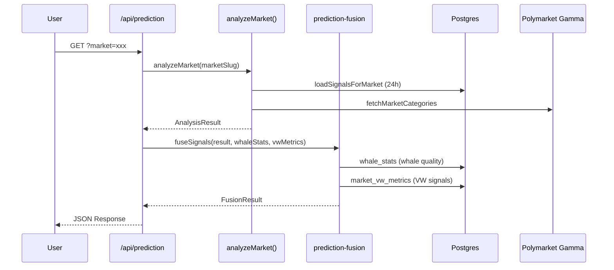

# SightWhale 预测方法论 — 设计文档

> **状态**: 已自审，待用户审核
> **日期**: 2026-08-07
> **作者**: SightWhale Team

---

## 1. 概述

### 1.1 核心理念

SightWhale 已积累三层预测信号（鲸鱼质量评分、行为模式检测、市场量价分析），但各信号独立运作。本方法论将它们统一为**单一融合预测分数**，并通过系统性回测验证有效性。

**核心假设**：聪明钱（whale）的历史行为模式 + 当前交易方向 + 量价偏离，三者共振时，预测准确率显著高于单一信号。

### 1.2 目标

1. **多信号融合层**：将 4 类信号加权合并为统一预测分数和方向
2. **回测框架**：用历史数据标定权重、验证准确率
3. **市场关联分析**：发现板块轮动和资金流向
4. **仓位管理**：基于 Kelly Criterion 的仓位建议

### 1.3 从描述到预测

当前系统是**描述型**（"这只鲸鱼在买入"），本方法论将其升级为**预测型**（"这只鲸鱼在买入 → 该市场看涨概率 72%"）。不引入 ML 模型，保持可解释的线性加权融合。

---

## 2. 架构设计

### 2.1 总体架构

```
┌─────────────────────────────────────────────────┐
│                  信号源（已有）                      │
├───────────────┬──────────────┬──────────────────┤
│ Whale Quality │  Behavior    │  Market Analysis │
│ (whale_stats) │  Detection   │  (VW + Flow)     │
│               │              │                  │
│ • whale_score │ • spike      │ • VW divergence  │
│ • 5 sub-score │ • build      │ • UAI            │
│ • win_rate    │ • exit       │ • velocity        │
│ • roi         │ • action_type│ • direction       │
│ • timing      │              │ • confidence      │
└───────┬───────┴──────┬───────┴────────┬─────────┘
        │              │                │
        └──────────────┼────────────────┘
                       ▼
        ┌─────────────────────────────┐
        │     Fusion Layer (新)        │
        │  • 归一化 (0-100)            │
        │  • 方向对齐 (±100)           │
        │  • 加权融合                  │
        │  • 一致性调整                │
        └─────────────┬───────────────┘
                      ▼
        ┌─────────────────────────────┐
        │    PredictionResult          │
        │  • compositeScore (0-100)   │
        │  • direction (bullish/...)  │
        │  • confidenceLevel          │
        │  • agreementScore           │
        └─────────────┬───────────────┘
                      ▼
        ┌─────────────────────────────┐
        │  Enhancements (新)           │
        │  • Market Correlation        │
        │  • Kelly Position Sizing     │
        └─────────────┬───────────────┘
                      ▼
        ┌─────────────────────────────┐
        │   Backtesting (新)           │
        │  • Walk-forward validation   │
        │  • Weight calibration        │
        │  • Baseline comparison       │
        └─────────────────────────────┘
```

### 2.2 与现有系统的关系

| 维度 | 现有系统 | 新增预测层 |
|------|---------|-----------|
| 分析层次 | 独立信号 | 信号融合 |
| 输出 | 描述 (direction, confidence) | 预测 (compositeScore, agreementScore) |
| 验证 | 无系统性回测 | Walk-forward 回测 |
| 增强 | 无 | 市场关联 + 仓位管理 |
| 兼容性 | 不破坏已有 API | 作为上层封装 |

### 2.3 数据流



---

## 3. 信号定义

### 3.1 Whale Quality Signal（鲸鱼质量信号）

**来源**：`whale_stats` 表，由 `whale_engine/engine.py:recompute_whale_stats()` 每 5 分钟更新。

**原始值**：`whale_score` (0-100)，由 5 个子分数加权合成：
- Performance (默认 30%): `0.7×score_roi(roi) + 0.3×win_rate×100`
- Consistency (默认 25%): `win_rate×100 - volatility_penalty`
- Timing (默认 20%): `((1-entry_percentile) + exit_percentile)/2 × 100`
- Risk (默认 15%): `0.7×dd_score + 0.3×score_rr(rr)`
- Impact (默认 10%): `0.5×log_size_score + 0.5×liquidity_score`

**归一化**：已是 0-100，直接使用。

**方向对齐**：取活跃鲸鱼的加权方向（按交易量加权）：
```
whale_direction = Σ(bullish_whale_scores × vol_i) / Σ(vol_i) 
                - Σ(bearish_whale_scores × vol_j) / Σ(vol_j)
```

### 3.2 Behavior Detection Signal（行为检测信号）

**来源**：`whale_engine/engine.py:detect_behavior()`，对每笔交易实时判定。

**原始值**：
| 行为 | 置信度 | 方向 |
|------|--------|------|
| spike BUY | 80 | +80 |
| build BUY | 75 | +75 |
| exit SELL | 85 | -85 |
| 无检测 | 0 | 0 |

**归一化**：`normalizedValue = abs(confidence)`（已是 0-100 对应值）。

**方向对齐**：BUY 为正，SELL 为负。

**聚合**：24h 窗口内所有 whale trades 的行为模式加权平均。

### 3.3 Volume-Weighted Analysis Signal（量价分析信号）

**来源**：`market_vw_metrics` 表，由 `whale_engine/vw.py:compute_vw_metrics()` 每小时更新。

**子指标**：

**3.3.1 VW Divergence**

```
VW_price_outcome = Σ(amount_i × price_i) / Σ(amount_i)
vw_yes_share = yes_vw_price / (yes_vw_price + no_vw_price)
divergence = vw_yes_share - market_yes_price
```

- 正值：聪明钱在 YES 方支付高于市场价格 → 看涨
- 负值：聪明钱在 NO 方支付高于市场价格 → 看跌
- 归一化：`min(100, |divergence| × 200)`
- 方向：divergence 的符号

**3.3.2 UAI (Underdog Affinity Index)**

```
if market_price < 0.5:
    underdog = YES, price = market_price
else:
    underdog = NO, price = 1 - market_price

UAI = underdog_vw_share / underdog_price
```

- UAI > 1: 聪明钱在买入冷门方（逆向信号）
- 归一化：`min(100, (UAI - 1) × 100)`
- 仅当价格 > 0.02 时有效（排除极端冷门）

**3.3.3 Velocity（偏离变化速率）**

```
velocity_Nm = (divergence_now - divergence_Nmin_ago) / N
```

- 检测情绪快速转变
- 归一化：`min(100, |velocity| / threshold × 100)`，threshold = 0.03/min

### 3.4 Flow Direction Signal（资金流向信号）

**来源**：`analysis-engine.ts:analyzeMarket()`。

**原始值**：
```
yesRatio = yesVolumeUsd / (yesVolumeUsd + noVolumeUsd)
flowScore = confidenceScore  // 已由 sizeScore × 0.4 + timeDecay × 0.3 + whaleScore × 0.3 计算
direction = classifyDirection(yesVolume, noVolume, tradeCount)
```

**归一化**：`flowScore` 已是 0-100。

**方向对齐**：`direction_signaled = direction === 'bullish' ? +flowScore : direction === 'bearish' ? -flowScore : 0`

---

## 4. 融合算法

### 4.1 默认权重配置

```
FusionConfig {
  whale_quality:    0.25  // 历史表现
  behavior:         0.25  // 当前行为模式
  vw_analysis:      0.25  // 量价偏离
  flow_direction:   0.25  // 资金流向
  agreementBonus:   1.20  // 信号一致 ×1.2
  conflictPenalty:  0.70  // 信号冲突 ×0.7
}
```

权重可通过回测标定优化。

### 4.2 计算步骤

**Step 1 — 归一化**：所有信号映射到 0-100。

```
normalized_i = clamp(signal_i, 0, 100)
```

**Step 2 — 方向对齐**：转为带符号值 `signed_i ∈ [-100, +100]`。

```
signed_i = normalized_i × sign(direction_i)
```

**Step 3 — 计算信号一致性**：

```
agreementScore = 1 - σ(signed_weights) / σ_max
其中 signed_weights_i = signed_i × weight_i
     σ_max = 50 (最大可能标准差，4 个信号分散在 ±100 时)
```

agreementScore ∈ [0, 1]，越高表示信号方向越一致。

**Step 4 — 加权融合**：

```
compositeScore = Σ(|signed_i| × weight_i) × agreementAdjustment
其中 agreementAdjustment = agreementScore > 0.7 ? 1.2 : agreementScore < 0.3 ? 0.7 : 1.0
```

**Step 5 — 方向判定**：

```
weightedDirection = Σ(signed_i × weight_i)
if   weightedDirection >  +15 → bullish
elif weightedDirection <  -15 → bearish
else                         → neutral
```

**Step 6 — 置信度分级**：

```
if compositeScore > 70 → high
if compositeScore > 40 → medium
else                   → low
```

### 4.3 融合伪代码

```
function fuseSignals(analysisResult, whaleStats, vwMetrics):
    signals = []

    // 1. Whale Quality
    avgWhaleScore = average(whaleStats.whale_score for active whales)
    whaleDirection = weightedDirection(activeWhaleDirections)
    signals.push({
        source: 'whale_quality',
        normalizedValue: avgWhaleScore,
        signedValue: whaleDirection > 0 ? +avgWhaleScore : -avgWhaleScore,
        weight: config.weights.whale_quality
    })

    // 2. Behavior
    behaviorValue = getBehaviorScore(recentBehaviors)
    signals.push({
        source: 'behavior',
        normalizedValue: abs(behaviorValue),
        signedValue: behaviorValue,
        weight: config.weights.behavior
    })

    // 3. VW Analysis
    if vwMetrics exists:
        vwScore = min(100, abs(vwMetrics.vw_divergence) * 200)
        signals.push({
            source: 'vw_analysis',
            normalizedValue: vwScore,
            signedValue: vwMetrics.vw_divergence > 0 ? +vwScore : -vwScore,
            weight: config.weights.vw_analysis
        })

    // 4. Flow Direction
    signals.push({
        source: 'flow_direction',
        normalizedValue: analysisResult.confidenceScore,
        signedValue: directionToSigned(analysisResult.direction, analysisResult.confidenceScore),
        weight: config.weights.flow_direction
    })

    // Compute agreement
    agreementScore = computeAgreement(signals)

    // Compute composite
    compositeScore = sum(s.normalizedValue * s.weight for s in signals)
    compositeScore *= agreementAdjustment(agreementScore)

    // Determine direction
    weightedDirection = sum(s.signedValue * s.weight for s in signals)
    direction = directionFromThreshold(weightedDirection)

    return FusionResult { compositeScore, direction, agreementScore, signals }
```

---

## 5. 回测方法

### 5.1 数据来源

```sql
SELECT
    a.id AS alert_id,
    a.whale_score,
    a.market_id,
    a.created_at AS signal_time,
    wth.side,
    wth.price AS entry_price,
    wth.pnl,
    wth.trade_usd,
    tr.market_title,
    tr.outcome
FROM alerts a
JOIN whale_trade_history wth ON wth.trade_id = a.whale_trade_id
JOIN trades_raw tr ON tr.trade_id = a.whale_trade_id
WHERE a.created_at BETWEEN :start AND :end
  AND wth.pnl IS NOT NULL
ORDER BY a.created_at ASC
```

### 5.2 Walk-Forward 验证流程

```
1. 将历史数据按时间排序
2. 70/30 分割：前 70% 训练集，后 30% 测试集
3. 训练集：网格搜索 FusionConfig weights，最大化 accuracy
4. 测试集：用标定后的固定权重计算所有指标
5. 对比基线：随机猜测、买入持有、市场平均
```

### 5.3 评估指标

| 指标 | 公式 | 含义 |
|------|------|------|
| Accuracy | `correct_predictions / total_settled` | 方向预测正确率 |
| Precision | `TP / (TP + FP)` | bullish 信号中真正涨的比例 |
| Win Rate | `profitable_trades / total_settled` | 盈利交易占比 |
| Avg ROI | `mean(roiPct)` | 平均每笔交易 ROI |
| Sharpe Ratio | `mean(roiPct) / std(roiPct) × √252` | 风险调整收益（年化） |
| Max Drawdown | `max(peak - trough) / peak` | 最大回撤 |
| Profit Factor | `sum(gains) / abs(sum(losses))` | 盈亏比 |

### 5.4 基线对比

| 基线 | 方法 | 预期值 |
|------|------|--------|
| Random | 50% 随机选 BUY/SELL | accuracy ≈ 50% |
| Buy & Hold | 每笔都 BUY YES，持有到结算 | 取决于市场 |
| Market Avg | 所有交易等权平均 ROI | ~0%（零和扣除手续费） |

---

## 6. 市场关联分析

### 6.1 关联性计算

利用 `market_vw_snapshots` 时间序列，对同 category（如 "Politics"、"Crypto"）内的市场两两计算 Pearson correlation：

```
r_xy = Σ((x_i - μ_x)(y_i - μ_y)) / (n × σ_x × σ_y)
```

其中 `x_i, y_i` 为两个市场在相同时刻的 VW divergence 值。

### 6.2 板块资金流向

```
CategoryFlow = {
    totalFlow: Σ(trade_usd in category),
    bullishRatio: bullish_flow / totalFlow,
    dominantDirection: bullishRatio > 0.6 ? 'bullish' : bearishRatio > 0.4 ? 'bearish' : 'neutral'
}
```

多个市场同时 bullish → 板块轮动信号。

---

## 7. Kelly Criterion 仓位管理

### 7.1 公式推导

对于二元结果（赢/输），Kelly 公式为：

```
f* = p - q / b

其中:
  p = 历史胜率 (winRate)
  q = 1 - p
  b = W / L (平均盈利 / 平均亏损绝对值)
```

### 7.2 实际应用

```
halfKelly = f* / 2              // Half-Kelly：保守策略
recommendedFraction = min(halfKelly, 0.25)  // 上限 25%
```

### 7.3 输入映射

| 参数 | 来源 | 计算方式 |
|------|------|----------|
| `p` | `summarizeHistoryByScoreTier` | 对应 score tier 的 winRate |
| `W` | 同上 | 对应 tier 的 avgRoi > 0 的子集平均 |
| `L` | 同上 | 对应 tier 的 avgRoi < 0 的子集平均绝对值 |

---

## 8. Plan 分级

| 功能 | Free | Pro | Elite |
|------|------|-----|-------|
| 基础方向预测 | ✓ | ✓ | ✓ |
| 融合分数 (compositeScore) | ✗ | ✓ | ✓ |
| 信号分量明细 | ✗ | ✓ | ✓ |
| 回测报告 | ✗ | ✗ | ✓ |
| 市场关联分析 | ✗ | ✗ | ✓ |
| Kelly 仓位建议 | ✗ | ✗ | ✓ |
| 自定义融合权重 | ✗ | ✗ | ✓ |

---

## 9. 附录：信号数据字典

### 9.1 WhaleStats（已有）

| 字段 | 类型 | 范围 | 说明 |
|------|------|------|------|
| whale_score | int | 0-100 | 综合评分 |
| performance_score | float | 0-100 | ROI + Win Rate |
| consistency_score | float | 0-100 | 稳定性 |
| timing_score | float | 0-100 | 择时能力 |
| risk_score | float | 0-100 | 风控能力 |
| impact_score | float | 0-100 | 市场影响力 |
| win_rate | float | 0-1 | 胜率 |
| roi | float | unbounded | 总 ROI |
| avg_entry_percentile | float | 0-1 | 平均入场分位 |
| avg_exit_percentile | float | 0-1 | 平均出场分位 |
| risk_reward_ratio | float | 0+ | 盈亏比 |

### 9.2 MarketVwMetrics（已有）

| 字段 | 类型 | 范围 | 说明 |
|------|------|------|------|
| vw_divergence | decimal | [-1, +1] | VW 偏离度 |
| uai | decimal | 0+ | 冷门厌恶指数 |
| vw_velocity_5m | decimal | unbounded | 5分钟变化速率 |
| signal_direction | string | bullish/bearish/neutral | VW 信号方向 |
| signal_strength | int | 0-100 | VW 信号强度 |
